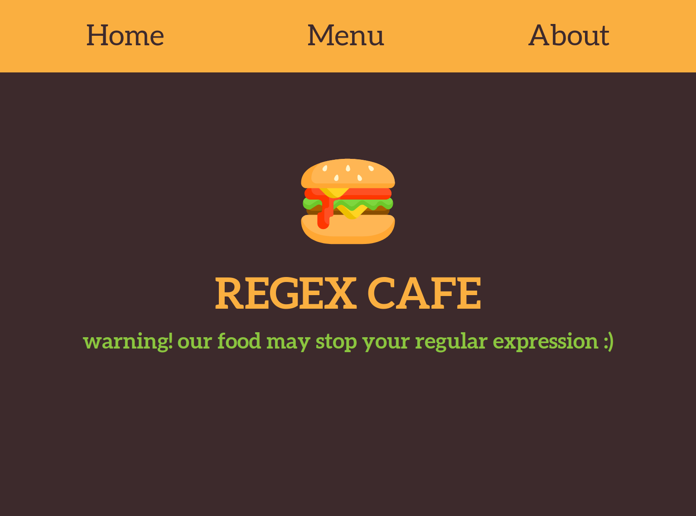

# Restaurant page
A single page app which shows menu, about and homepage of a restaurant. The app is build using javascript.

## Project Description
> This project containes three tabs in a single page. The tabs can be accessed via the navbar.

> The goal of this project was to get acquainted with webpack and DOM manipulation with javascript.

## Screenshot

## Built With

- HTML/CSS
- Javascript

## Live Demo

- [Regex Cafe](https://rawcdn.githack.com/ershadul1/js-restaurant-page/cb7f828083aa68300fd43bed49bce578cc87d162/dist/index.html)

## How to run this project on your local machine

### Prerequisites
1. An internet browser

   
### Steps to follow
1. Clone the repository to your local machine using `git clone https://github.com/ershadul1/js-restaurant-page.git`
1. On your local machine, navigate to folder using `cd js-restaurant-page` in your terminal.
1. Navigate to dist folder.
1. Open the `index.html` with your preferred browser.

## Contributions

  There are two ways of contributing to this project:

1.  If you see something wrong or not working, please check [the issue tracker section](https://github.com/ershadul1/js-restaurant-page/issues), if that problem you met is not in already opened issues then open the issue by clicking on `new issue` button.

2.  If you have a solution to that, and you are willing to work on it, follow the below steps to contribute:
    1.  Fork this repository
    1.  Clone it on your local computer by running `git clone https://github.com/ershadul1/js-restaurant-page.git` __Replace *ershadul1* with the username you use on github__
    1.  Open the cloned repository which appears as a folder on your local computer with your favorite code editor
    1.  Create a separate branch off the *master branch*,
    1.  Write your codes which fix the issue you found
    1.  Commit and push the branch you created
    1.  Raise a pull request, comparing your new created branch with our original master branch [here](https://github.com/ershadul1/js-restaurant-page)

## Author 

👤 **Ershadul Rayhan**

- Github: [@ershadul1](https://github.com/ershadul1)
- Twitter: [@ErshadulRayhan](https://twitter.com/ErshadulRayhan)
- Linkedin: [ErshadulRayhan](https://www.linkedin.com/in/ershadulrayhan/)
- Email:  ershadul.rayhan@gmail.com

## Show your support

Give a ⭐️ if you like this project!

## Acknowledgments
- This project was inspired by the [Microverse](https:www.microverse.org) program